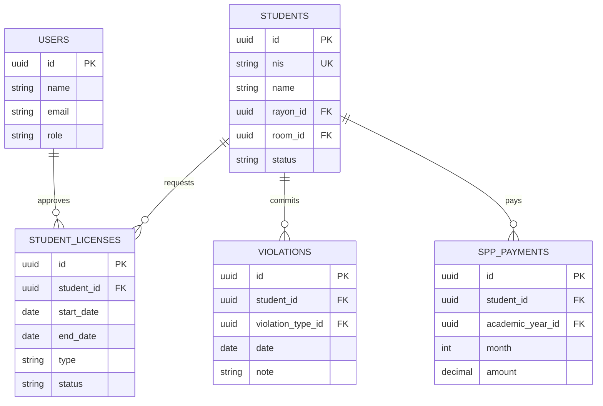
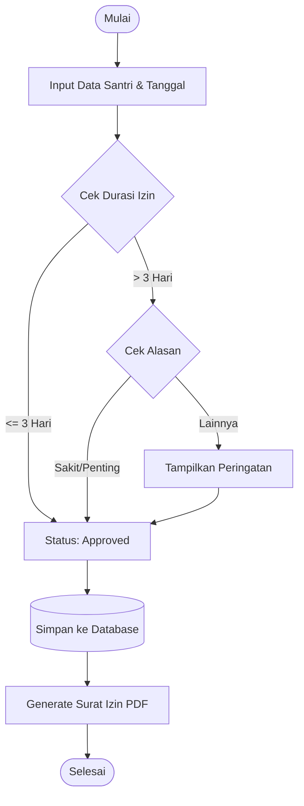
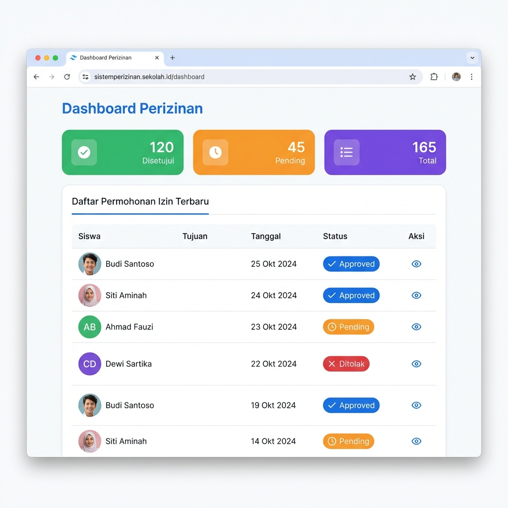

# Sistem Informasi Manajemen Santri (SIMS)
**Pondok Pesantren Annuqayah Latee II**


Aplikasi ini adalah Sistem Informasi Manajemen (SIM) yang dirancang untuk digitalisasi administrasi pondok pesantren. Sistem ini dikembangkan menggunakan metode **Waterfall** untuk memastikan alur pengembangan yang terstruktur dan sesuai dengan kebutuhan pengguna.

## 🚀 Fitur Utama

### 1. Dashboard Integrasi
- Ringkasan statistik real-time (Jumlah Santri, Izin Aktif, Pelanggaran Terbaru).
- Grafik visualisasi data santri per rayon/jenjang.

### 2. Manajemen Data Master
- **Data Santri**: Pengelolaan biodata lengkap santri.
- **Data Akademik**: Tahun ajaran, periode, kelas, dan jenjang pendidikan.
- **Data Asrama**: Manajemen gedung (rayon) dan kamar.

### 3. Modul Perizinan (Licensing)
- **Digitalisasi Izin**: Pengajuan izin pulang/keluar secara digital.
- **Validasi Bertingkat**: Sistem persetujuan oleh pengurus berwenang.
- **Surat Jalan Otomatis**: Cetak surat izin resmi dengan format baku.
- **Riwayat Perizinan**: Tracking history keluar-masuk santri.

### 4. Modul Kedisiplinan (Violations)
- **Pencatatan Pelanggaran**: Input data pelanggaran santri.
- **Poin & Sanksi**: Manajemen jenis pelanggaran dan bobot poin.
- **Laporan Kedisiplinan**: Rekapitulasi perilaku santri untuk evaluasi.

### 5. Modul Keuangan (SPP)
- **Pembayaran SPP**: Pencatatan transaksi pembayaran bulanan.
- **Tagihan & Tunggakan**: Monitoring status pembayaran santri.
- **Laporan Keuangan**: Rekap pemasukan periode tertentu.

## 🛠️ Metode Pengembangan: Waterfall

Sistem ini dibangun mengikuti tahapan SDLC **Waterfall**:
1.  **Requirement Analysis**: Analisis kebutuhan administrasi pesantren.
2.  **System Design**: Perancangan database (ERD) dan antarmuka (UI/UX).
3.  **Implementation**: Coding menggunakan Laravel & Tailwind CSS.
4.  **Testing**: Pengujian fungsionalitas sistem (Black Box Testing).
5.  **Maintenance**: Pemeliharaan dan update fitur.

## 📝 Alur Sistem & Diagram

### 1. Use Case Diagram (Global)
```mermaid
usecaseDiagram
    actor "Administrator" as Admin
    actor "Pengurus Asrama" as Staff

    package "Sistem Informasi Santri" {
        usecase "Manajemen Data Santri" as UC_Santri
        usecase "Manajemen Perizinan" as UC_Izin
        usecase "Manajemen Pelanggaran" as UC_Langgar
        usecase "Manajemen Keuangan (SPP)" as UC_SPP
        usecase "Laporan & Cetak" as UC_Report
    }

    Admin --> UC_Santri
    Admin --> UC_Izin
    Admin --> UC_Langgar
    Admin --> UC_SPP
    Admin --> UC_Report

    Staff --> UC_Izin
    Staff --> UC_Langgar
```

### 2. Entity Relationship Diagram (ERD)
Sesuaikan dengan struktur database saat ini:



### 3. Detail Modul: Perizinan
**Flowchart Validasi Izin**


### 4. Desain Prototipe
**Dashboard Perizinan**


---
**Skripsi Tahun 2025/2026**
