# SPK Kepulangan Santri - Metode SAW
**Sistem Pendukung Keputusan Kepulangan Santri Pondok Pesantren Annuqayah Latee II**


Aplikasi ini adalah Sistem Pendukung Keputusan (SPK) yang dirancang untuk membantu pengurus pondok pesantren dalam menentukan rekomendasi kepulangan santri berdasarkan kriteria-kriteria objektif menggunakan metode **SAW (Simple Additive Weighting)**.

## 🚀 Fitur Utama

### 1. Dashboard Eksekutif
- Statistik jumlah santri, kriteria, dan hasil rekomendasi.
- Visualisasi grafik (Chart.js) untuk sebaran status dan top ranking santri.
- Akses cepat ke modul-modul utama.

### 2. Manajemen Data Master
- **Data Santri**: CRUD data santri lengkap dengan fitur **Import & Export Excel**.
- **Data Kriteria**: Pengaturan bobot kriteria dinamis dengan validasi total bobot.
- **Data Periode**: Manajemen periode penilaian (misal: "Periode Maret 2024") untuk pengarsipan riwayat yang rapi.

### 3. Sistem Penilaian & Perhitungan SAW
- **Input Penilaian**: Form penilaian santri berdasarkan kriteria yang aktif.
- **Kalkulasi Otomatis**:
    - Normalisasi Bobot ($w_j / \Sigma w$).
    - Nilai Normalisasi ($r_{ij}$).
    - Nilai Akhir ($u_i(a_i) \times w_{normal}$).
- **Transparansi Perhitungan**: Fitur "Detail Perhitungan" yang menampilkan rumus dan langkah-langkah kalkulasi step-by-step untuk setiap santri.

### 4. Analisis Sensitivitas (Robustness Test)
- Fitur simulasi untuk menguji ketahanan (robustness) hasil keputusan.
- Pengguna dapat mengubah bobot kriteria secara real-time menggunakan **Slider UI**.
- Membandingkan **Ranking Lama vs Ranking Baru** untuk melihat dampak perubahan bobot.
- Visualisasi indikator input vs normalisasi otomatis.

### 5. Laporan & Output
- **Rekomendasi Keputusan**: Status "Direkomendasikan", "Pertimbangkan", atau "Tidak Direkomendasikan" berdasarkan threshold nilai.
- **Cetak PDF**: Laporan resmi dengan kop surat, daftar peringkat, dan tanda tangan pimpinan.

## 🛠️ Teknologi yang Digunakan
- **Backend**: Laravel (PHP Framework)
- **Frontend**: Blade Templates, Tailwind CSS
- **Interactivity**: 
    - Alpine.js (Modal, UI Reaktif)
    - Tom Select (Searchable Dropdown)
    - SweetAlert2 (Modern Confirm Dialog)
- **Database**: MySQL
- **Library Pendukung**:
    - `maatwebsite/excel` (Import/Export Data)
    - `dompdf/dompdf` (Cetak Laporan PDF)
    - `chart.js` (Visualisasi Grafik)

## 📦 Cara Instalasi

Ikuti langkah berikut untuk menjalankan proyek ini di komputer lokal (Localhost):

1.  **Clone Repository**
    ```bash
    git clone https://github.com/SafaNa/spk-pondok.git
    cd spk-pondok
    ```

2.  **Install Dependencies**
    ```bash
    composer install
    npm install && npm run build
    ```

3.  **Konfigurasi Environment**
    - Copy file `.env.example` menjadi `.env`.
    - Atur koneksi database di file `.env`:
    ```env
    DB_CONNECTION=mysql
    DB_HOST=127.0.0.1
    DB_PORT=3306
    DB_DATABASE=spk_pondok
    DB_USERNAME=root
    DB_PASSWORD=
    ```

4.  **Generate Key & Migrate Database**
    ```bash
    php artisan key:generate
    php artisan migrate --seed
    ```
    *(Gunakan `--seed` untuk mengisi database dengan data dummy awal)*

5.  **Jalankan Aplikasi**
    ```bash
    php artisan serve
    ```
    Buka `http://127.0.0.1:8000` di browser.

## 📝 Alur Penggunaan

1.  **Login** sebagai Administrator.
2.  Masuk ke menu **Periode**, buat periode baru dan set sebagai "Aktif".
3.  Pastikan **Data Kriteria** dan bobotnya sudah sesuai.
4.  Input **Data Santri** (bisa manual atau import Excel).
5.  Lakukan **Penilaian** pada menu SPK SAW -> Hitung.
6.  Lihat hasil pada menu **Rekomendasi**.
7.  (Opsional) Gunakan **Analisis Sensitivitas** untuk simulasi perubahan bobot.
8.  Cetak laporan hasil keputusan.

---

## 📊 Activity Diagram & Flowchart

### Activity Diagram - Sistem Keseluruhan


### Flowchart - Algoritma SAW

```mermaid
flowchart TD
    A([Mulai Perhitungan SAW]) --> B[Ambil semua data kriteria dan bobot]
    B --> C[Ambil data penilaian santri untuk periode aktif]
    C --> D[Hitung Total Bobot Semua Kriteria]
    D --> E[Loop: Untuk setiap kriteria]
    
    E --> F{Jenis Kriteria?}
    
    F -->|Benefit| G[Ambil nilai MAX dari subkriteria]
    G --> H["Normalisasi = Nilai / MAX"]
    
    F -->|Cost| I[Ambil nilai MIN dari subkriteria]
    I --> J["Normalisasi = MIN / Nilai"]
    
    H --> K["Bobot Ternormalisasi = Bobot / Total Bobot"]
    J --> K
    
    K --> L["Nilai Kriteria = Normalisasi × Bobot Ternormalisasi"]
    L --> M[Tambahkan ke Nilai Akhir]
    M --> N{Masih ada kriteria?}
    N -->|Ya| E
    N -->|Tidak| O[Simpan Nilai Akhir ke database]
    O --> P{Nilai Akhir >= 0.7?}
    
    P -->|Ya| Q["Status: DIREKOMENDASIKAN ✅"]
    P -->|Tidak| R{Nilai Akhir >= 0.4?}
    R -->|Ya| S["Status: DIPERTIMBANGKAN ⚠️"]
    R -->|Tidak| T["Status: TIDAK DIREKOMENDASIKAN ❌"]
    
    Q --> U[Generate Alasan Rekomendasi]
    S --> U
    T --> U
    U --> V[Simpan ke Riwayat Hitung]
    V --> W([Selesai])
```



### Entity Relationship Diagram (ERD)


### Use Case Diagram

```mermaid
flowchart LR
    subgraph System["SPK Pondok Pesantren"]
        UC1((Login))
        UC2((Manage Santri))
        UC3((Manage Kriteria))
        UC4((Manage Periode))
        UC5((Input Penilaian))
        UC6((Hitung SAW))
        UC7((Lihat Rekomendasi))
        UC8((Cetak Laporan))
        UC9((Analisis Sensitivitas))
    end
    
    Admin["🧑‍💼 Admin"] --> UC1
    Admin --> UC2
    Admin --> UC3
    Admin --> UC4
    Admin --> UC5
    Admin --> UC6
    Admin --> UC7
    Admin --> UC8
    Admin --> UC9
    
    UC5 -.->|include| UC6
    UC6 -.->|include| UC7
```



### Logika Rekomendasi

| Nilai Akhir | Status | Deskripsi |
|:-----------:|:------:|-----------|
| ≥ 0.70 | ✅ Direkomendasikan | Santri memenuhi kriteria dengan sangat baik |
| 0.40 - 0.69 | ⚠️ Dipertimbangkan | Santri memiliki potensi, perlu evaluasi lebih lanjut |
| < 0.40 | ❌ Tidak Direkomendasikan | Santri belum memenuhi kriteria minimum |

> 📄 **Dokumentasi lengkap**: Lihat [docs/activity_diagram_flowchart.md](docs/activity_diagram_flowchart.md) untuk diagram tambahan termasuk Sequence Diagram dan Activity Diagram per modul.

---
**Skripsi Tahun 2025/2026**
