# Activity Diagram & Flowchart SPK Pondok

## Deskripsi Aplikasi

Aplikasi **SPK Pondok** adalah Sistem Pendukung Keputusan (Decision Support System) yang menggunakan metode **SAW (Simple Additive Weighting)** untuk memberikan rekomendasi santri di pondok pesantren berdasarkan kriteria-kriteria yang telah ditentukan.

---

## 1. Activity Diagram - Sistem Keseluruhan

---

## 2. Activity Diagram - Proses Login

---

## 3. Activity Diagram - Manajemen Data Santri

---

## 4. Activity Diagram - Manajemen Kriteria & Subkriteria

---

## 5. Activity Diagram - Proses Penilaian Santri

---

## 6. Flowchart - Algoritma SAW (Simple Additive Weighting)

```mermaid
flowchart TD
    A([Mulai Perhitungan SAW]) --> B[Ambil semua data kriteria dan bobot]
    B --> C[Ambil data penilaian santri untuk periode aktif]
    C --> D[Hitung Total Bobot Semua Kriteria]
    D --> E[Loop: Untuk setiap kriteria]
    
    E --> F{Jenis Kriteria?}
    
    F -->|Benefit| G[Ambil nilai MAX dari subkriteria]
    G --> H["Normalisasi = Nilai / MAX"]
    
    F -->|Cost| I[Ambil nilai MIN dari subkriteria]
    I --> J["Normalisasi = MIN / Nilai"]
    
    H --> K["Bobot Ternormalisasi = Bobot / Total Bobot"]
    J --> K
    
    K --> L["Nilai Kriteria = Normalisasi × Bobot Ternormalisasi"]
    L --> M[Tambahkan ke Nilai Akhir]
    M --> N{Masih ada kriteria?}
    N -->|Ya| E
    N -->|Tidak| O[Simpan Nilai Akhir ke database]
    O --> P{Nilai Akhir >= 0.7?}
    
    P -->|Ya| Q["Status: DIREKOMENDASIKAN ✅"]
    P -->|Tidak| R{Nilai Akhir >= 0.4?}
    R -->|Ya| S["Status: DIPERTIMBANGKAN ⚠️"]
    R -->|Tidak| T["Status: TIDAK DIREKOMENDASIKAN ❌"]
    
    Q --> U[Generate Alasan Rekomendasi]
    S --> U
    T --> U
    U --> V[Simpan ke Riwayat Hitung]
    V --> W([Selesai])
```

---

## 7. Activity Diagram - Lihat Hasil & Rekomendasi

---

## 8. Activity Diagram - Analisis Sensitivitas

---

## 9. Flowchart - Use Case Diagram

```mermaid
flowchart LR
    subgraph System["SPK Pondok Pesantren"]
        UC1((Login))
        UC2((Manage Santri))
        UC3((Manage Kriteria))
        UC4((Manage Subkriteria))
        UC5((Manage Periode))
        UC6((Input Penilaian))
        UC7((Hitung SAW))
        UC8((Lihat Rekomendasi))
        UC9((Cetak Laporan))
        UC10((Analisis Sensitivitas))
        UC11((Lihat History))
        UC12((Export Data))
    end
    
    Admin["🧑‍💼 Admin"] --> UC1
    Admin --> UC2
    Admin --> UC3
    Admin --> UC4
    Admin --> UC5
    Admin --> UC6
    Admin --> UC7
    Admin --> UC8
    Admin --> UC9
    Admin --> UC10
    Admin --> UC11
    Admin --> UC12
    
    UC3 -.->|include| UC4
    UC6 -.->|include| UC7
    UC7 -.->|include| UC8
```

---

## 10. Entity Relationship Diagram (ERD)

---

## 11. Sequence Diagram - Proses Perhitungan SAW

---

## Ringkasan Fitur Utama

| No | Modul | Deskripsi |
|:--:|-------|-----------|
| 1 | **Authentication** | Login, Logout, Ganti Password |
| 2 | **Dashboard** | Statistik santri, kriteria, hasil penilaian |
| 3 | **Master Santri** | CRUD data santri, Import/Export Excel |
| 4 | **Master Kriteria** | CRUD kriteria dengan jenis Benefit/Cost |
| 5 | **Master Subkriteria** | CRUD subkriteria dengan nilai numerik |
| 6 | **Master Periode** | CRUD periode penilaian, aktivasi periode |
| 7 | **Penilaian** | Input nilai santri per kriteria |
| 8 | **Perhitungan SAW** | Normalisasi, pembobotan, scoring |
| 9 | **Rekomendasi** | Ranking santri, status rekomendasi |
| 10 | **Analisis Sensitivitas** | Simulasi perubahan bobot kriteria |
| 11 | **History** | Riwayat perhitungan per periode |
| 12 | **Cetak Laporan** | Export hasil ke PDF |

---

## Logika Rekomendasi

| Nilai Akhir | Status | Deskripsi |
|:-----------:|:------:|-----------|
| ≥ 0.70 | ✅ Direkomendasikan | Santri memenuhi kriteria dengan sangat baik |
| 0.40 - 0.69 | ⚠️ Dipertimbangkan | Santri memiliki potensi, perlu evaluasi lebih lanjut |
| < 0.40 | ❌ Tidak Direkomendasikan | Santri belum memenuhi kriteria minimum |
